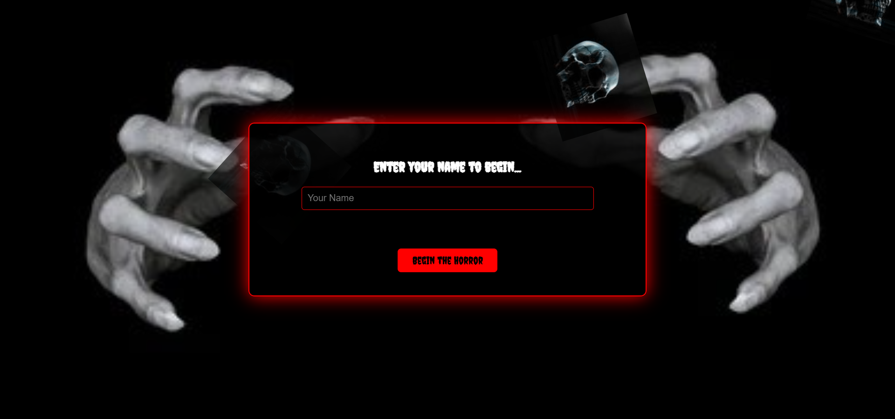

# 👻 Haunted Quiz Website

A spine-chilling interactive quiz website built with HTML, CSS, and JavaScript. Inspired by classic horror myths and legends, this quiz tests your creepy knowledge while immersing you in a haunted atmosphere full of eerie visuals and sound effects.

## 🌌 Features

- 🔐 **Login Page** with animated skulls and creepy nail effects.
- ❓ **Interactive Horror Quiz** with multiple questions and selectable options.
- 🔊 **Scary Sound Effects** (jumpscares, whispers, crackles, and scratches).
- 🖼️ **Haunted Background & Fonts** that bring the horror vibe to life.
- 🎭 Animated elements to create an immersive eerie environment.
- 🔁 Quiz reusability and smooth transitions.

## 🛠️ Tech Stack

- **HTML5** – Markup structure
- **CSS3** – Styling and horror-themed animations
- **JavaScript** – Quiz logic and interactivity
- **Google Fonts** – "Creepster" font for the spooky title
- **Netlify** – Deployment platform

## 🎮 How to Play

1. Enter your name to begin.
2. Face a series of haunted questions.
3. Click on one of the options to see if you survive... or not.

> Best played with sound on and lights off 👀

## 🚀 Live Demo

👉 [Click here to visit the live website](https://hauntedquiz.netlify.app/) 

## 📸 Preview

## ✨ Credits

- Sound effects from [Freesound.org](https://freesound.org)
- Fonts by [Google Fonts](https://fonts.google.com/)
- Inspired by Halloween and childhood nightmares 😱

## 🧛‍♀️ Author

**Priyanshi Mittal**  
Frontend Developer & Curious Explorer of Cyber Worlds  
🔗 [LinkedIn](www.linkedin.com/in/priyanshi-mittal14 )

---

🩸 *Face your fears... one quiz at a time.*  

